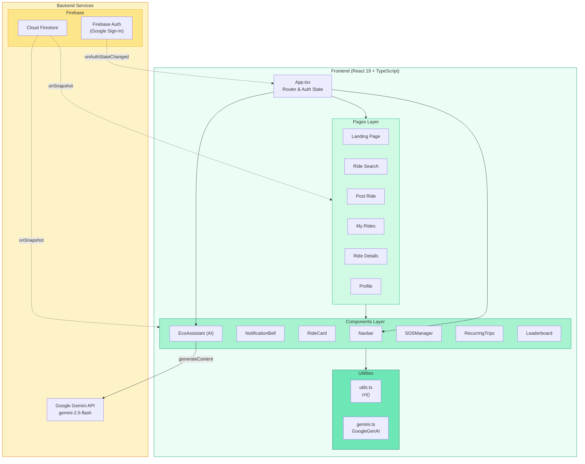
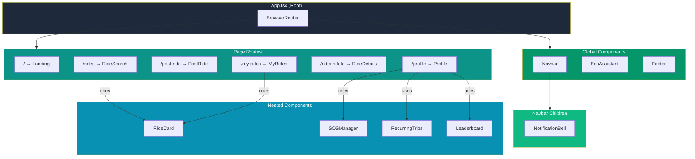
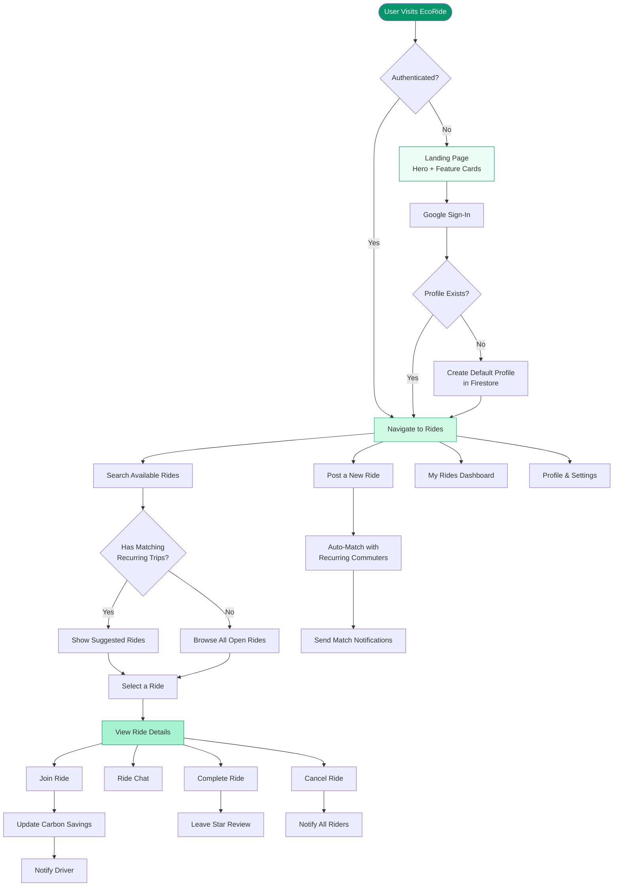
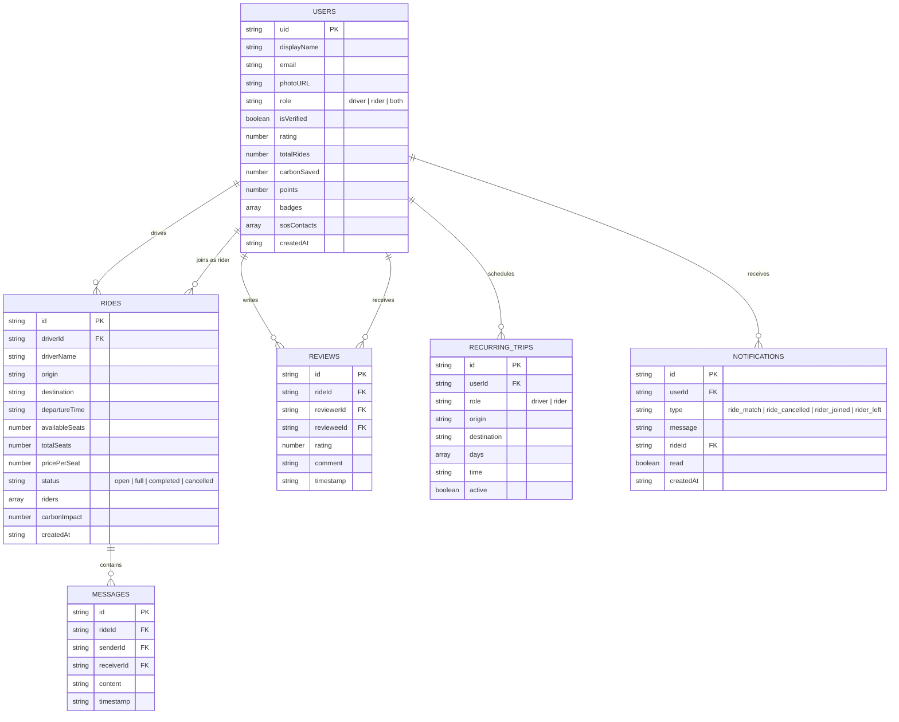
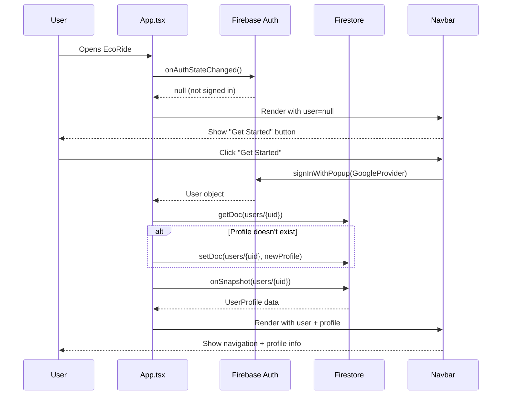
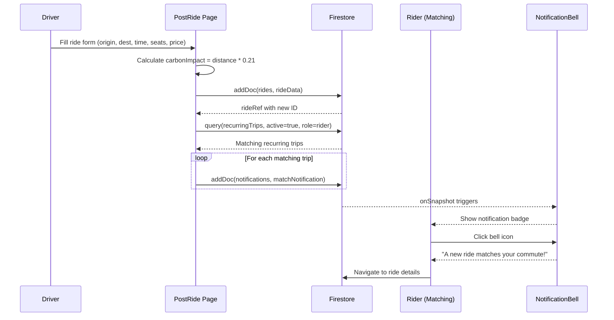

# 🌿 EcoRide — Complete Application Documentation

> **Version:** 1.0.0  
> **Author:** Naresh K  
> **Tech Stack:** React 19 · TypeScript 5.8 · Firebase · Gemini AI · Tailwind CSS 4  
> **Last Updated:** June 2025

---

## Table of Contents

1. [Executive Summary](#1-executive-summary)
2. [Architecture Overview](#2-architecture-overview)
3. [Component Hierarchy](#3-component-hierarchy)
4. [User Flow](#4-user-flow)
5. [Database Schema](#5-database-schema)
6. [Authentication Flow](#6-authentication-flow)
7. [Module Documentation (STAR Method)](#7-module-documentation-star-method)
   - 7.1 [App.tsx — Application Root](#71-apptsx--application-root)
   - 7.2 [firebase.ts — Firebase Configuration](#72-firebasets--firebase-configuration)
   - 7.3 [types.ts — TypeScript Interfaces](#73-typests--typescript-interfaces)
   - 7.4 [Navbar Component](#74-navbar-component)
   - 7.5 [NotificationBell Component](#75-notificationbell-component)
   - 7.6 [EcoAssistant Component (Gemini AI)](#76-ecoassistant-component-gemini-ai)
   - 7.7 [SOSManager Component](#77-sosmanager-component)
   - 7.8 [Leaderboard Component](#78-leaderboard-component)
   - 7.9 [RecurringTrips Component](#79-recurringtrips-component)
   - 7.10 [RideCard Component](#710-ridecard-component)
   - 7.11 [Landing Page](#711-landing-page)
   - 7.12 [RideSearch Page](#712-ridesearch-page)
   - 7.13 [PostRide Page](#713-postride-page)
   - 7.14 [MyRides Page](#714-myrides-page)
   - 7.15 [RideDetails Page](#715-ridedetails-page)
   - 7.16 [Profile Page](#716-profile-page)
   - 7.17 [Utility Modules (lib/)](#717-utility-modules-lib)
   - 7.18 [Firestore Security Rules](#718-firestore-security-rules)
8. [Ride Posting & Auto-Match Flow](#8-ride-posting--auto-match-flow)
9. [Technology Stack Details](#9-technology-stack-details)
10. [Project Structure](#10-project-structure)
11. [Getting Started](#11-getting-started)

---

## 1. Executive Summary

**EcoRide** is a next-generation eco-friendly ride-sharing web application built to connect commuters who want to reduce their carbon footprint while saving money. It features real-time ride matching, AI-powered eco-coaching via Google's Gemini model, a gamified carbon savings tracker, emergency SOS contacts, real-time messaging, and a community leaderboard — all powered by Firebase's real-time infrastructure.

The application is architected as a **modular, single-page React application** with 14 focused TypeScript files, following component-based architecture with clear separation between pages, reusable components, and utility libraries.

---

## 2. Architecture Overview

The following diagram shows the high-level system architecture of EcoRide:



**Key Architecture Decisions:**
- **Real-time first**: All data subscriptions use Firestore `onSnapshot` listeners for instant updates
- **Client-side routing**: React Router 7 manages navigation with protected route guards
- **Serverless backend**: Firebase handles auth, database, and security rules — no custom backend
- **AI integration**: Google Gemini API called directly from the client for the EcoAssistant chatbot

---

## 3. Component Hierarchy



**Component Responsibilities:**
| Layer | Components | Purpose |
|-------|-----------|---------|
| **Root** | `App.tsx` | Auth state, routing, layout shell |
| **Global** | `Navbar`, `EcoAssistant`, Footer | Persistent UI across all pages |
| **Pages** | 6 page components | Full-screen views for each route |
| **Shared** | `RideCard`, `SOSManager`, `RecurringTrips`, `Leaderboard` | Reusable UI blocks embedded in pages |

---

## 4. User Flow



---

## 5. Database Schema



**Collections Summary:**

| Collection | Documents | Purpose |
|-----------|-----------|---------|
| `users` | Per-user document keyed by UID | User profiles, eco stats, SOS contacts, badges |
| `rides` | Per-ride document | Ride listings with driver, route, pricing, status |
| `rides/{id}/messages` | Subcollection | Real-time chat messages scoped to each ride |
| `reviews` | Per-review document | Star ratings and comments between users |
| `recurringTrips` | Per-schedule document | Commute schedules for auto-matching |
| `notifications` | Per-notification document | In-app notifications for ride events |

---

## 6. Authentication Flow



**Security Notes:**
- Authentication is handled entirely by Firebase Auth with Google as the only provider
- Route protection uses React Router's `<Navigate>` component—unauthenticated users are redirected to `/`
- Profile creation is atomic: checked on first auth, created if missing
- Real-time profile sync via `onSnapshot` ensures the UI always reflects the latest state

---

## 7. Module Documentation (STAR Method)

> Each module is documented using the **STAR method**:
> - **S** — Situation: The context/problem that necessitated this module
> - **T** — Task: The specific objective this module fulfills
> - **A** — Action: How the module is implemented (technical details)
> - **R** — Result: The outcome and value delivered

---

### 7.1 App.tsx — Application Root

**📁 File:** `src/App.tsx` | **Lines:** ~115 | **Type:** Root Component

#### Situation
A ride-sharing application needs a centralized entry point that manages authentication state, user profile data, routing between pages, and the overall layout shell. Without a well-structured root, auth state would leak across components, causing inconsistent UI and security gaps.

#### Task
Create a root component that:
- Listens to Firebase authentication state changes in real-time
- Auto-creates user profiles for first-time sign-ins
- Subscribes to real-time profile updates from Firestore
- Manages protected routing (authenticated vs. unauthenticated)
- Renders the persistent layout (Navbar, Footer, EcoAssistant)
- Shows a branded loading animation during initialization

#### Action
```
App.tsx
├── State: user (Firebase User), profile (UserProfile), loading (boolean)
├── useEffect: onAuthStateChanged listener
│   ├── On sign-in: check/create profile → onSnapshot for real-time profile
│   └── On sign-out: clear profile, unsubscribe listeners
├── Loading: Animated Car icon with Framer Motion
├── Layout: Navbar → Routes → Footer → EcoAssistant
└── Routes:
    ├── / → Landing (public)
    ├── /rides → RideSearch (protected)
    ├── /ride/:rideId → RideDetails (protected)
    ├── /post-ride → PostRide (protected)
    ├── /my-rides → MyRides (protected)
    ├── /profile → Profile (protected)
    └── * → Redirect to /
```

**Key Implementation Details:**
- Uses `onAuthStateChanged` as the single source of truth for auth
- Nested `onSnapshot` listener ensures profile stays in sync with Firestore
- Proper cleanup: both auth and profile listeners are unsubscribed on unmount
- Protected routes use ternary: `user ? <Component /> : <Navigate to="/" />`

#### Result
- **Single responsibility**: One component owns auth + routing, preventing scattered auth checks
- **Real-time sync**: Profile changes (role updates, badge awards) reflect instantly across all pages
- **Clean lifecycle**: No memory leaks — all Firestore listeners are properly cleaned up
- **User experience**: Smooth loading state with animated branding instead of a blank screen

---

### 7.2 firebase.ts — Firebase Configuration

**📁 File:** `src/firebase.ts` | **Lines:** ~24 | **Type:** Configuration Module

#### Situation
The app requires a centralized Firebase configuration to initialize the app, authentication, and Firestore database. Multiple modules need access to these services, and hardcoding configuration in each file would create maintenance nightmares and potential inconsistencies.

#### Task
Create a single configuration module that:
- Initializes Firebase from the external config JSON
- Exports shared `auth` and `db` instances
- Provides convenient `signInWithGoogle()` and `logout()` helper functions
- Tests the Firestore connection on startup

#### Action
```typescript
// Core exports:
export const auth = getAuth(app);           // Firebase Auth instance
export const db = getFirestore(app, dbId);  // Firestore with custom database ID
export const signInWithGoogle = () => signInWithPopup(auth, googleProvider);
export const logout = () => signOut(auth);
```

- Firebase config is imported from `firebase-applet-config.json` (external, not committed)
- Uses `getFirestore` with a custom database ID for multi-database support
- Connection test runs on import to detect offline/misconfigured clients early

#### Result
- **Centralized config**: Every module imports from one source — no config drift
- **Type-safe exports**: Auth and Firestore instances are properly typed
- **Early failure detection**: Connection test surfaces misconfigurations at startup
- **Clean API**: `signInWithGoogle()` and `logout()` are one-liner helpers used throughout the app

---

### 7.3 types.ts — TypeScript Interfaces

**📁 File:** `src/types.ts` | **Lines:** ~78 | **Type:** Type Definitions

#### Situation
A complex ride-sharing app with users, rides, messages, reviews, notifications, and recurring trips needs a shared type system. Without centralized types, each component would define its own shapes, leading to runtime errors and data inconsistencies.

#### Task
Define comprehensive TypeScript interfaces for every data entity in the system, ensuring type safety across all components and pages.

#### Action

| Interface | Key Fields | Purpose |
|-----------|-----------|---------|
| `UserProfile` | uid, displayName, role, rating, carbonSaved, points, badges, sosContacts | User identity + gamification |
| `Ride` | driverId, origin, destination, availableSeats, status, riders, carbonImpact | Ride listing data |
| `Message` | rideId, senderId, content, timestamp | Real-time chat messages |
| `Review` | reviewerId, revieweeId, rating, comment | Post-ride feedback |
| `RecurringTrip` | userId, origin, destination, days, time, active | Commute schedules |
| `Notification` | userId, type, message, rideId, read | In-app alerts |
| `SOSContact` | name, phone | Emergency contacts |

**Design Decisions:**
- `UserProfile.role` uses union type `'driver' | 'rider' | 'both'` for compile-time safety
- `Ride.status` uses `'open' | 'full' | 'completed' | 'cancelled'` — exactly 4 lifecycle states
- `Notification.type` uses `'ride_match' | 'ride_cancelled' | 'rider_joined' | 'rider_left'` — 4 event types
- All timestamps are ISO strings for Firestore compatibility

#### Result
- **Full type safety**: Every Firestore read is cast to the correct interface
- **Self-documenting**: Interface definitions serve as documentation for the data model
- **Compile-time errors**: Typos in field names or wrong types are caught before runtime
- **Shared vocabulary**: All 14 source files reference the same type definitions

---

### 7.4 Navbar Component

**📁 File:** `src/components/Navbar.tsx` | **Lines:** ~126 | **Type:** Global Component

#### Situation
A carpooling app needs a persistent navigation bar that adapts to authentication state — showing sign-in for guests and full navigation with profile info for authenticated users. It must also work on mobile devices with a responsive hamburger menu.

#### Task
Build a responsive navigation component that:
- Shows the EcoRide brand with a car icon
- Displays navigation links (Find Rides, Offer Ride, My Rides) for authenticated users
- Shows user profile info with avatar, name, and carbon savings
- Integrates the NotificationBell component
- Provides a mobile-responsive hamburger menu with animations
- Handles sign-in and sign-out actions

#### Action
```
Navbar
├── Props: user (Firebase User | null), profile (UserProfile | null)
├── Desktop View:
│   ├── Logo (Car icon + "EcoRide")
│   ├── Nav Links: Find Rides, Offer Ride, My Rides
│   ├── Profile Section: Name, carbon stats, avatar, NotificationBell, logout
│   └── Guest: "Get Started" CTA button
├── Mobile View:
│   ├── Hamburger/X toggle button
│   └── AnimatePresence: Animated slide-down menu
│       ├── Same nav links as desktop
│       └── Sign-in/logout actions
└── Sticky: top-0 z-50 with shadow-sm
```

**Key Features:**
- Uses Framer Motion's `AnimatePresence` for smooth mobile menu open/close
- Carbon savings displayed inline: `{profile?.carbonSaved.toFixed(1)}kg saved`
- DiceBear API fallback for users without a Google profile photo
- Auto-closes mobile menu on navigation via `setIsOpen(false)`

#### Result
- **Responsive**: Seamlessly adapts from mobile hamburger to desktop horizontal layout
- **Context-aware**: Shows different UI for guests vs. authenticated users
- **Real-time stats**: Carbon savings update in real-time via profile subscription
- **Animated**: Smooth mobile menu transitions enhance the user experience

---

### 7.5 NotificationBell Component

**📁 File:** `src/components/NotificationBell.tsx` | **Lines:** ~82 | **Type:** Shared Component

#### Situation
Users need to be informed in real-time about ride-related events — when someone joins their ride, when a ride is cancelled, or when a new ride matches their commute schedule. Without push notifications, the app needs an in-app notification system.

#### Task
Build a real-time notification bell with:
- Live unread count badge
- Dropdown showing recent notifications with timestamps
- Auto-mark-as-read when opened
- Clickable notifications that navigate to the related ride

#### Action
```
NotificationBell
├── Props: user (Firebase User)
├── Firestore Query: notifications where userId == user.uid, ordered by createdAt desc, limit 20
├── Real-time: onSnapshot listener for instant updates
├── UI Elements:
│   ├── Bell icon with red badge (unread count, max "9+")
│   ├── Dropdown panel (w-80, rounded-2xl, shadow-xl)
│   │   ├── Header: "Notifications"
│   │   ├── List: message + formatted timestamp (date-fns)
│   │   └── Empty state: "No notifications yet"
│   └── Unread highlighting: emerald-50 background
└── Actions:
    ├── Toggle dropdown on bell click
    └── markAllRead: batch update all unread → read: true
```

**Notification Types Handled:**
| Type | Trigger | Example Message |
|------|---------|----------------|
| `ride_match` | New ride matches recurring trip | "A new ride from A to B matches your commute!" |
| `rider_joined` | Rider joins your ride | "A new rider joined your ride from A to B!" |
| `rider_left` | Rider leaves your ride | "A rider has left your ride from A to B" |
| `ride_cancelled` | Driver cancels ride | "The ride from A to B has been cancelled" |

#### Result
- **Real-time**: Notifications appear instantly via Firestore `onSnapshot` — no polling
- **Unread tracking**: Red badge with count provides at-a-glance awareness
- **Seamless navigation**: Clicking a notification takes the user directly to the ride
- **Auto-read**: Opening the dropdown marks all as read, reducing notification noise

---

### 7.6 EcoAssistant Component (Gemini AI)

**📁 File:** `src/components/EcoAssistant.tsx` | **Lines:** ~142 | **Type:** Global Component

#### Situation
Users may have questions about sustainable transportation, carbon savings, or how to use EcoRide's features. A static FAQ page can't handle the variety of questions. The app needs an intelligent, context-aware assistant that can provide personalized eco-friendly travel advice.

#### Task
Build an AI-powered floating chatbot that:
- Uses Google's Gemini 2.5 Flash model for fast, intelligent responses
- Maintains conversation history for contextual follow-ups
- Focuses on eco-friendly transportation and EcoRide features
- Has a beautiful floating widget UI with smooth animations

#### Action
```
EcoAssistant
├── State: isOpen, messages (ChatMessage[]), input, loading
├── Initial Message: Welcome greeting about eco-friendly assistance
├── Gemini Integration:
│   ├── Model: gemini-2.5-flash
│   ├── System Instruction: "You are EcoRide's AI assistant — friendly, concise expert
│   │   on sustainable transportation, carpooling, carbon footprint reduction..."
│   ├── Conversation History: Maps all previous messages as context
│   └── Error Handling: Graceful fallback messages
├── UI Structure:
│   ├── Floating Button: w-14 h-14, emerald/gray, Bot/X icon toggle
│   ├── Chat Window: w-80/w-96, max-height 500px
│   │   ├── Header: Emerald bg, "Eco Assistant" title
│   │   ├── Message Area: Scrollable, auto-scroll to bottom
│   │   │   ├── User bubbles: emerald-600, right-aligned
│   │   │   ├── Bot bubbles: gray-100, left-aligned
│   │   │   └── Loading: 3 bouncing dots animation
│   │   └── Input Form: Text input + Send button
│   └── Animations: Framer Motion scale/fade transitions
└── API Call Flow:
    1. User types message → added to state
    2. Full history sent to Gemini (maintains context)
    3. Response streamed back → added to messages
    4. Errors caught → friendly fallback shown
```

#### Result
- **Intelligent responses**: Gemini AI provides knowledgeable answers about eco-transportation
- **Contextual**: Full conversation history is sent with each request for coherent multi-turn chats
- **Non-intrusive**: Floating button doesn't interfere with page content
- **Fast**: Gemini 2.5 Flash model optimized for speed over quality-heavy tasks
- **Error-resilient**: API failures show a friendly message instead of crashing

---

### 7.7 SOSManager Component

**📁 File:** `src/components/SOSManager.tsx` | **Lines:** ~85 | **Type:** Shared Component

#### Situation
Safety is paramount in ride-sharing. Users need a way to store emergency contacts that can be quickly accessed during a ride. This is especially important for solo riders traveling with strangers.

#### Task
Build an emergency contact management system that:
- Allows adding/removing SOS contacts (name + phone)
- Persists contacts to the user's Firestore profile
- Provides a clean, accessible UI with immediate feedback

#### Action
```
SOSManager
├── Props: user (Firebase User), profile (UserProfile | null)
├── State: contacts (SOSContact[]), showAdd, newName, newPhone
├── Operations:
│   ├── handleAdd: Append contact → updateDoc(users/{uid}, { sosContacts: updated })
│   └── handleRemove: Filter by index → updateDoc(users/{uid}, { sosContacts: updated })
├── UI:
│   ├── Contact List: Phone icon + name + phone + delete button
│   ├── Add Form: Name input + Phone input + Save/Cancel buttons
│   └── Add Button: Red theme ("Add SOS Contact" / "Add Another Contact")
└── Validation: Required fields via HTML5 form validation
```

#### Result
- **Persistent**: Contacts survive across sessions — stored in Firestore user document
- **Immediate**: No page reload needed — local state + Firestore update happen together
- **Safety-focused**: Red color scheme visually distinguishes SOS from regular features
- **Scalable**: Supports unlimited emergency contacts per user

---

### 7.8 Leaderboard Component

**📁 File:** `src/components/Leaderboard.tsx` | **Lines:** ~65 | **Type:** Shared Component

#### Situation
Gamification is key to driving sustained eco-friendly behavior. Users need motivation beyond personal stats — seeing how they rank against others creates healthy competition and encourages more carpooling.

#### Task
Build a real-time leaderboard showing the top 10 users ranked by carbon savings, with visual ranking indicators and live data updates.

#### Action
```
Leaderboard
├── State: topUsers (UserProfile[]), loading
├── Firestore Query: users, orderBy carbonSaved desc, limit 10
├── Real-time: onSnapshot for live ranking updates
├── UI:
│   ├── Header: Star icon + "Eco Leaderboard"
│   ├── Loading: Spinning emerald circle
│   └── Rankings:
│       ├── #1: Gold badge (amber-100)
│       ├── #2: Silver badge (gray-200)
│       ├── #3: Bronze badge (orange-100)
│       └── #4-10: Plain gray number
│       Each entry: Rank + Avatar + Name + Carbon saved (kg)
└── Embedded in: Profile page (left sidebar)
```

#### Result
- **Real-time competition**: Rankings update live as users complete rides
- **Visual hierarchy**: Gold, silver, bronze visual distinction for top 3
- **Motivational**: Users see their peers' savings, creating social pressure to carpool more
- **Lightweight**: Only fetches top 10 — minimal Firestore reads

---

### 7.9 RecurringTrips Component

**📁 File:** `src/components/RecurringTrips.tsx` | **Lines:** ~148 | **Type:** Shared Component

#### Situation
Many users have daily commute patterns (e.g., home to office, Monday–Friday at 8 AM). Manually searching for matching rides every day is tedious. The app needs a way to register recurring schedules so it can automatically suggest matching rides.

#### Task
Build a recurring commute schedule manager that:
- Lets users create schedules with origin, destination, days of week, time, and role
- Displays existing schedules with active/paused status
- Feeds data into the auto-matching system for ride suggestions and notifications

#### Action
```
RecurringTrips
├── Props: user (Firebase User)
├── State: trips (RecurringTrip[]), loading, showAdd, newTrip form
├── Firestore: query(recurringTrips) where userId == user.uid, real-time
├── Create Flow:
│   ├── Form: Origin, Destination, Day toggles, Time picker, Role select
│   ├── Day Selection: Toggle chips (Mon, Tue, Wed... clickable pills)
│   ├── Validation: At least one day must be selected
│   └── Save: addDoc(recurringTrips, { ...newTrip, userId, active: true })
├── Display:
│   └── Trip Card: Icon (Car/Users based on role) + Route + Days + Time + Status badge
└── Integration:
    ├── RideSearch: Queries user's trips to suggest matching rides
    └── PostRide: Queries ALL active rider trips to send match notifications
```

#### Result
- **Set-and-forget**: Users register once, get matched automatically going forward
- **Multi-day support**: Toggle individual days (e.g., Mon/Wed/Fri only)
- **Role-aware**: Different icons/behavior for driver vs. rider schedules
- **Powers auto-matching**: The backbone of the suggestion and notification system

---

### 7.10 RideCard Component

**📁 File:** `src/components/RideCard.tsx` | **Lines:** ~88 | **Type:** Shared Component

#### Situation
Ride listings appear in multiple places (search results, suggested rides, my rides). Each listing needs to show the same essential info — driver, route, time, price, seats, carbon impact — in a consistent, attractive format.

#### Task
Create a reusable ride preview card with:
- Driver info with avatar initial and verified badge
- Route visualization (origin → destination with connected dots)
- Key stats: date/time, available seats, price, carbon savings
- "View Details" navigation link

#### Action
```
RideCard
├── Props: ride (Ride)
├── Layout:
│   ├── Header: Driver avatar initial + name + "Verified Driver" badge + Price
│   ├── Route: Vertical connected dots (origin → destination marker)
│   ├── Stats Grid: Calendar + date | Users + seats left
│   └── Footer: Carbon badge (-Xkg CO₂) | "View Details" button
├── Animations: Framer Motion layout + fade-in + scale
├── Interactions:
│   ├── Hover: shadow-sm → shadow-xl transition
│   └── Click "View Details": Link to /ride/{id}
└── Formatting: date-fns for readable dates ("MMM d, h:mm a")
```

#### Result
- **DRY**: One component used in RideSearch (3 places) and MyRides (2 lists)
- **Information-dense**: All critical ride info visible at a glance without clicking
- **Eco-prominent**: Green carbon badge highlights environmental impact
- **Animated**: Smooth enter animations make the ride grid feel polished

---

### 7.11 Landing Page

**📁 File:** `src/pages/Landing.tsx` | **Lines:** ~104 | **Type:** Page Component

#### Situation
First-time visitors need to immediately understand what EcoRide is, why it matters, and how to get started. The landing page is the app's first impression and must communicate value within seconds.

#### Task
Create a compelling landing page with:
- A hero section with tagline, description, and dual CTAs
- Feature cards highlighting safety, eco-impact, and cost savings
- Smooth entrance animations

#### Action
```
Landing Page
├── Hero Section:
│   ├── Background: Emerald-50 with blurred gradient circles (decorative)
│   ├── Badge: "Eco-Friendly Commuting" with Leaf icon
│   ├── Headline: "Ride Together, Save the Planet."
│   ├── Description: Connect, split costs, reduce carbon footprint
│   ├── CTA Buttons:
│   │   ├── Primary: "Find a Ride" (emerald-600, shadow-xl)
│   │   └── Secondary: "Offer a Ride" (white, bordered)
│   └── Animation: Framer Motion fade-up on mount
├── Feature Cards Section: 3-column grid
│   ├── Verified Safety (ShieldAlert icon)
│   ├── Eco-Impact Tracking (Leaf icon)
│   └── Cost Splitting (DollarSign icon)
└── FeatureCard Component: Icon + title + description, hover shadow effect
```

#### Result
- **Clear value proposition**: Users understand EcoRide in 3 seconds
- **Dual CTAs**: Both finding and offering rides are equally prominent
- **Trust signals**: Safety verification, eco tracking, and cost savings address top concerns
- **Polished**: Entrance animation and hover effects create a premium feel

---

### 7.12 RideSearch Page

**📁 File:** `src/pages/RideSearch.tsx` | **Lines:** ~100 | **Type:** Page Component (Protected)

#### Situation
Users need to find available rides efficiently. A simple list isn't enough — users with recurring commutes should see personalized suggestions, and all users need search/filter capabilities.

#### Task
Build a ride discovery page that:
- Shows personalized ride suggestions based on the user's recurring trip schedules
- Provides text search filtering by origin or destination
- Displays rides in a responsive card grid
- Updates in real-time as new rides are posted

#### Action
```
RideSearch
├── Props: user (Firebase User)
├── Data Sources (real-time):
│   ├── rides: where status == 'open', orderBy departureTime asc
│   └── recurringTrips: where userId == user.uid, active == true
├── Computed:
│   ├── filteredRides: rides filtered by search text (origin/destination)
│   └── suggestedRides: rides matching recurringTrips (origin + destination + role)
├── UI Sections:
│   ├── Suggested Rides (conditional): Star icon header + up to 3 matching rides
│   ├── Search Bar: Magnifying glass icon + "Where are you going?" placeholder
│   ├── Rides Grid: 1/2/3 columns responsive grid of RideCards
│   └── Empty State: Car icon + "No rides found" + suggestion text
└── Matching Logic:
    suggestedRides = rides where ANY recurringTrip matches:
    - Same origin (case-insensitive)
    - Same destination (case-insensitive)  
    - Complementary role (user is rider → ride exists | user is driver → excluded)
```

#### Result
- **Personalized**: Suggested rides appear prominently, reducing search effort
- **Real-time**: New rides appear instantly without page refresh
- **Searchable**: Quick text filter narrows results without requerying Firestore
- **Smart matching**: Only shows rides that complement the user's role (riders see rides needing riders)

---

### 7.13 PostRide Page

**📁 File:** `src/pages/PostRide.tsx` | **Lines:** ~165 | **Type:** Page Component (Protected)

#### Situation
Drivers need a frictionless way to offer rides. The form should collect essential information (route, time, seats, price), automatically calculate the eco-impact, and notify matching commuters about the new ride.

#### Task
Build a ride creation form that:
- Collects origin, destination, departure time, seats, and price
- Calculates carbon impact automatically
- Creates the ride in Firestore
- Auto-matches and notifies users with matching recurring trip schedules
- Requires account verification before posting

#### Action
```
PostRide
├── Props: user (Firebase User), profile (UserProfile | null)
├── State: formData, submitting
├── Verification Check: Alert if profile.isVerified is false
├── Carbon Calculation:
│   distance = max(10, (origin.length + destination.length) * 1.5)  // estimate
│   carbonImpact = (distance * 0.21).toFixed(1)  // kg CO₂
├── Submit Flow:
│   1. Build rideData with all form fields + computed values
│   2. addDoc(rides, rideData) → get rideRef.id
│   3. Query: recurringTrips where active=true AND role='rider'
│   4. For each matching trip (same origin+destination, different user):
│      → addDoc(notifications, { type: 'ride_match', ... })
│   5. Navigate to /rides
├── Form UI:
│   ├── Origin + Destination (side by side with MapPin icons)
│   ├── Departure Time (datetime-local with Calendar icon)
│   ├── Available Seats + Price per Seat (side by side number inputs)
│   └── Submit button with loading state
└── Animations: Framer Motion fade-up entrance
```

**Auto-Match Notification Flow:**



#### Result
- **Low-friction**: Clean form with sensible defaults (3 seats, $10/seat)
- **Automatic eco-tracking**: Carbon impact calculated without driver input
- **Smart notifications**: Matching commuters are immediately notified
- **Verified-only**: Only verified accounts can post rides, maintaining trust

---

### 7.14 MyRides Page

**📁 File:** `src/pages/MyRides.tsx` | **Lines:** ~85 | **Type:** Page Component (Protected)

#### Situation
Users who are active as both drivers and riders need a single dashboard to see all their ride activity — rides they're offering and rides they've joined. Without this, they'd have to search for their own rides in the general listing.

#### Task
Build a personal rides dashboard that:
- Displays rides offered by the user (as driver)
- Displays rides joined by the user (as rider)
- Uses real-time listeners for both lists
- Shows empty states with appropriate CTAs

#### Action
```
MyRides
├── Props: user (Firebase User)
├── Firestore Queries (real-time, parallel):
│   ├── offeredRides: rides where driverId == user.uid, orderBy departureTime desc
│   └── joinedRides: rides where riders array-contains user.uid, orderBy departureTime desc
├── UI:
│   ├── Header: "My Rides"
│   ├── Section 1: "Rides I'm Offering"
│   │   ├── Car icon header
│   │   ├── Grid of RideCards (or empty state → "Offer your first ride" link)
│   ├── Section 2: "Rides I've Joined"
│   │   ├── Users icon header
│   │   └── Grid of RideCards (or empty state → "Find a ride to join" link)
└── Loading: Spinner while data loads
```

#### Result
- **Complete overview**: Both driver and rider activity in one view
- **Real-time**: Ride status changes (join/leave/complete/cancel) update instantly
- **Action-oriented**: Empty states link directly to ride creation or search
- **Reuses RideCard**: Consistent ride presentation across the app

---

### 7.15 RideDetails Page

**📁 File:** `src/pages/RideDetails.tsx` | **Lines:** ~380 | **Type:** Page Component (Protected)

#### Situation
Individual rides need a full-featured detail page where riders can join/leave, drivers can manage the ride, participants can chat in real-time, and completed rides can be reviewed. This is the most complex page in the application.

#### Task
Build a comprehensive ride detail page supporting:
- Full ride information display with driver profile and ratings
- Join/leave ride actions with seat management
- Driver actions: complete ride, cancel ride with rider notifications
- Real-time ride chat between participants
- Post-ride review system with star ratings
- Carbon savings tracking on join

#### Action
```
RideDetails
├── Props: user (Firebase User), profile (UserProfile | null)
├── URL Param: rideId (from React Router)
├── Data (real-time):
│   ├── ride: onSnapshot(rides/{rideId})
│   ├── messages: onSnapshot(rides/{rideId}/messages, orderBy timestamp)
│   └── driverRating: getDocs(reviews where revieweeId == driver) → computed average
├── Computed Roles:
│   ├── isDriver: ride.driverId === user.uid
│   ├── isRider: ride.riders.includes(user.uid)
│   └── canJoin: !isDriver && !isRider && seats > 0 && status === 'open'
├── Actions:
│   ├── handleJoin:
│   │   1. arrayUnion(user.uid) to riders
│   │   2. Decrement availableSeats
│   │   3. Auto-set status to 'full' if seats == 0
│   │   4. Update user: carbonSaved, totalRides, points, badges
│   │   5. Send 'rider_joined' notification to driver
│   ├── handleLeaveRide:
│   │   1. arrayRemove(user.uid) from riders
│   │   2. Increment availableSeats, set status 'open'
│   │   3. Send 'rider_left' notification to driver
│   ├── handleCancelRide (driver only):
│   │   1. Confirm dialog
│   │   2. Set status 'cancelled'
│   │   3. Send 'ride_cancelled' notification to ALL riders
│   ├── handleCompleteRide (driver only):
│   │   1. Set status 'completed'
│   ├── handleSendMessage:
│   │   1. addDoc to rides/{rideId}/messages subcollection
│   └── handleReview:
│   │   1. addDoc to reviews collection
│   │   2. Auto-selects review target (riders review driver, driver reviews riders)
├── UI Sections:
│   ├── Ride Info Card: Status badge + route + price + departure + seats + carbon
│   ├── Driver Info: Avatar + name + verified badge + average rating
│   ├── Action Buttons: Join / Joined + Leave / Complete + Cancel / Cancelled
│   ├── Review Form (completed rides): Star selector + comment + submit
│   ├── Chat Panel: Message history + input form (active rides only)
│   └── Review submitted confirmation
└── Sidebar: (reserved for future widgets)
```

**Gamification on Join:**
| Metric | Update |
|--------|--------|
| `carbonSaved` | `+= ride.carbonImpact` |
| `totalRides` | `+= 1` |
| `points` | `+= 50` |
| Badge: "Eco Warrior" | Awarded at 100kg CO₂ saved |
| Badge: "Frequent Flyer" | Awarded at 10 total rides |

#### Result
- **Full ride lifecycle**: Open → riders join → full → completed → reviewed (or cancelled)
- **Real-time chat**: Participants communicate without leaving the page
- **Gamified**: Joining a ride rewards points, carbon stats, and potential badge unlocks
- **Notification-driven**: Every action (join, leave, cancel) notifies affected users
- **Fair reviews**: Auto-targeting ensures riders review drivers and vice versa

---

### 7.16 Profile Page

**📁 File:** `src/pages/Profile.tsx` | **Lines:** ~175 | **Type:** Page Component (Protected)

#### Situation
Users need a centralized hub to view their eco-impact, manage account settings, see their achievements, configure emergency contacts, set up commute schedules, and check their position on the community leaderboard.

#### Task
Build a comprehensive profile page integrating:
- User info card with avatar and verification status
- Eco impact statistics (carbon saved, points, total rides)
- Achievements/badges display
- Account settings (role preference)
- Emergency SOS contact management
- Recurring commute schedules
- Community leaderboard

#### Action
```
Profile Page
├── Props: user (Firebase User), profile (UserProfile | null)
├── Layout: 3-column grid (1 sidebar + 2 content)
├── Sidebar (col-span-1):
│   ├── Profile Card:
│   │   ├── Avatar (132px, emerald border, verified badge overlay)
│   │   ├── Name + email
│   │   └── "Verify Account" button (if not verified)
│   ├── Eco Impact Card (emerald-600 bg, white text):
│   │   ├── Carbon saved (4xl font) + "kg CO₂ saved"
│   │   ├── Eco Points (4xl font)
│   │   └── Total Rides count
│   └── Leaderboard Component
├── Content (col-span-2):
│   ├── Achievements Section:
│   │   └── Badge list (amber-50 pills with star icons) or empty state
│   ├── Recurring Commutes:
│   │   └── RecurringTrips Component (full CRUD)
│   ├── Account Settings:
│   │   ├── Preferred Role: View/edit (rider/driver/both)
│   │   ├── Trust Score: 5-star visual + numeric rating
│   │   └── Save Changes button (edit mode)
│   └── Emergency SOS Section (red-50 bg):
│       ├── ShieldAlert icon + description
│       └── SOSManager Component (full CRUD)
└── Integrates: Leaderboard, RecurringTrips, SOSManager (3 sub-components)
```

#### Result
- **One-stop hub**: All personal settings and stats accessible from one page
- **Compositional**: Embeds 3 independent sub-components cleanly
- **Visual impact**: Large eco-stats with bold fonts create pride and motivation
- **Safety-prominent**: Red-themed SOS section stands out for emergency awareness

---

### 7.17 Utility Modules (lib/)

**📁 Files:** `src/lib/utils.ts` + `src/lib/gemini.ts` | **Type:** Utility Libraries

#### Situation
Multiple components need shared utility functions — particularly CSS class merging with Tailwind conflict resolution. The Gemini AI client also needs centralized initialization to avoid multiple instances.

#### Task
Create lightweight utility modules:
1. `cn()` — A Tailwind CSS class merger combining `clsx` (conditional classes) with `tailwind-merge` (conflict resolution)
2. `genAI` — A singleton Google GenAI client instance

#### Action

**utils.ts:**
```typescript
import { clsx, type ClassValue } from 'clsx';
import { twMerge } from 'tailwind-merge';

export function cn(...inputs: ClassValue[]) {
  return twMerge(clsx(inputs));
}
```

**gemini.ts:**
```typescript
import { GoogleGenAI } from '@google/genai';

export const genAI = new GoogleGenAI({ apiKey: process.env.GEMINI_API_KEY || '' });
```

#### Result
- **`cn()`**: Used in 8+ components for conditional classes without Tailwind conflicts (e.g., `cn("text-red-500", isActive && "text-green-500")` correctly resolves to one color)
- **`genAI`**: Single instance shared across all AI-powered features, API key from environment variables
- **Minimal footprint**: 6 lines total — no over-engineering

---

### 7.18 Firestore Security Rules

**📁 File:** `firestore.rules` | **Lines:** ~100 | **Type:** Backend Security

#### Situation
A serverless Firebase app where Firestore is accessed directly from the client requires comprehensive security rules. Without them, any authenticated user could read/write any data, creating severe security vulnerabilities.

#### Task
Implement security rules that:
- Require authentication for all operations
- Restrict document writes to document owners
- Validate data shapes on create/update
- Allow drivers to manage their rides while letting riders join/leave
- Restrict message access to ride participants only
- Provide admin override capabilities

#### Action
```
Security Rules Structure
├── Helper Functions:
│   ├── isAuthenticated() — checks request.auth != null
│   ├── isOwner(userId) — checks auth.uid matches
│   ├── isAdmin() — checks role == 'admin' OR specific email
│   ├── isValidUser(data) — validates user document shape
│   ├── isValidRecurringTrip(data) — validates trip shape
│   └── isValidRide(data) — validates ride shape
├── Collection Rules:
│   ├── /users/{userId}:
│   │   ├── Read: authenticated
│   │   ├── Create/Update: owner only + valid data
│   │   └── Delete: admin only
│   ├── /recurringTrips/{tripId}:
│   │   ├── Read: authenticated
│   │   ├── Create: owner match + valid data
│   │   ├── Update: owner match + valid data
│   │   └── Delete: owner only
│   ├── /rides/{rideId}:
│   │   ├── Read: authenticated
│   │   ├── Create: driver match + valid data
│   │   ├── Update: driver OR riders (limited to riders/seats/status fields)
│   │   └── Delete: driver only
│   ├── /rides/{rideId}/messages/{messageId}:
│   │   ├── Read: ride driver OR ride riders only
│   │   └── Create: sender match
│   ├── /reviews/{reviewId}:
│   │   ├── Read: authenticated
│   │   └── Create: reviewer match
│   └── /notifications/{notificationId}:
│       ├── Read: owner only
│       ├── Create: authenticated
│       └── Update: owner only (for marking read)
```

#### Result
- **Principle of least privilege**: Each operation has the minimum required access
- **Data validation**: Invalid documents are rejected at the database level
- **Ride update safety**: Riders can only modify `riders`, `availableSeats`, and `status` — not price or driver
- **Chat privacy**: Messages only readable by ride participants (driver + riders)
- **Admin backdoor**: Specific email + admin role for emergency operations

---

## 8. Ride Posting & Auto-Match Flow

This sequence diagram shows the complete flow when a driver posts a new ride and the system auto-matches it with commuters who have recurring trip schedules:


---

## 9. Technology Stack Details

| Technology | Version | Purpose |
|-----------|---------|---------|
| **React** | 19.0.0 | UI framework with hooks and functional components |
| **TypeScript** | 5.8 | Type safety across the entire codebase |
| **Vite** | 6.x | Fast build tool with HMR and `@` path aliases |
| **Tailwind CSS** | 4.x | Utility-first CSS via `@tailwindcss/vite` plugin |
| **Firebase Auth** | 12.11.0 | Google sign-in authentication |
| **Cloud Firestore** | 12.11.0 | Real-time NoSQL database |
| **Google Gemini AI** | 1.29.0 | AI chatbot (`gemini-2.5-flash` model) |
| **React Router** | 7.14.0 | Client-side routing with protected routes |
| **Framer Motion** | 12.38.0 | Animations (page transitions, UI feedback) |
| **Lucide React** | 0.546.0 | SVG icon library (consistent icon system) |
| **date-fns** | 4.1.0 | Date formatting ("MMM d, h:mm a") |
| **clsx** | 2.1.1 | Conditional CSS class names |
| **tailwind-merge** | 3.5.0 | Tailwind class conflict resolution |

---

## 10. Project Structure

```
EcoRide/
├── src/
│   ├── App.tsx                    # Root: auth state, routing, layout
│   ├── main.tsx                   # Entry point: ReactDOM.createRoot
│   ├── firebase.ts                # Firebase init, auth helpers
│   ├── types.ts                   # All TypeScript interfaces (7 types)
│   ├── index.css                  # Tailwind CSS import
│   │
│   ├── components/                # Reusable UI components
│   │   ├── Navbar.tsx             # Global navigation bar
│   │   ├── NotificationBell.tsx   # Real-time notification dropdown
│   │   ├── EcoAssistant.tsx       # Gemini AI chatbot widget
│   │   ├── SOSManager.tsx         # Emergency contacts CRUD
│   │   ├── Leaderboard.tsx        # Top 10 carbon savers
│   │   ├── RecurringTrips.tsx     # Commute schedule manager
│   │   └── RideCard.tsx           # Ride preview card
│   │
│   ├── pages/                     # Route-level page components
│   │   ├── Landing.tsx            # Public homepage
│   │   ├── RideSearch.tsx         # Browse + search rides
│   │   ├── PostRide.tsx           # Create new ride
│   │   ├── MyRides.tsx            # Personal rides dashboard
│   │   ├── RideDetails.tsx        # Full ride view + actions
│   │   └── Profile.tsx            # User profile + settings
│   │
│   └── lib/                       # Utility modules
│       ├── utils.ts               # cn() class merger
│       └── gemini.ts              # Google GenAI client
│
├── firestore.rules                # Firestore security rules
├── firebase-applet-config.json    # Firebase config (external)
├── firebase-blueprint.json        # Firebase project blueprint
├── package.json                   # Dependencies and scripts
├── tsconfig.json                  # TypeScript configuration
├── vite.config.ts                 # Vite build configuration
├── index.html                     # HTML entry point
├── metadata.json                  # App metadata
├── README.md                      # Project overview
└── DOCUMENTATION.md               # This file
```

---

## 11. Getting Started

### Prerequisites
- Node.js 18+
- Firebase project with Firestore and Google Auth enabled
- Google Gemini API key

### Installation

```bash
# Clone the repository
git clone https://github.com/your-username/EcoRide.git
cd EcoRide

# Install dependencies
npm install

# Set environment variables
export GEMINI_API_KEY="your-gemini-api-key"

# Start development server
npm run dev        # → http://localhost:3000
```

### Available Scripts

| Script | Command | Purpose |
|--------|---------|---------|
| `dev` | `vite --port=3000` | Start dev server with HMR |
| `build` | `vite build` | Production build to `dist/` |
| `preview` | `vite preview` | Preview production build |
| `clean` | `rm -rf dist` | Remove build artifacts |
| `lint` | `tsc --noEmit` | Type-check without emitting |

---

> **End of Documentation**  
> Built with ❤️ for a greener planet.
